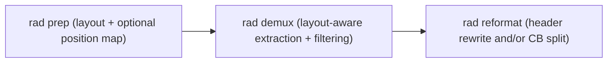

# RAD (Read-structure Agnostic Demultiplexer)

RAD is a layout-aware demultiplexer for sequencing reads.

Plain English version: you define read structure once, RAD finds barcode/UMI/read segments, applies whitelist-aware filtering/correction, then writes output for downstream analysis.

## Docs map

| Need | File |
| --- | --- |
| Install/build | [`docs/installation.md`](docs/installation.md) |
| First run (`prep -> demux -> reformat`) | [`docs/quickstart.md`](docs/quickstart.md) |
| Exact command/flag behavior | [`docs/cli-reference.md`](docs/cli-reference.md) |
| Layout + whitelist details (origins, sizes, pairings) | [`docs/layouts-and-whitelists.md`](docs/layouts-and-whitelists.md) |
| What RAD does under the hood | [`docs/architecture.md`](docs/architecture.md) |
| Output file contract | [`docs/output-files.md`](docs/output-files.md) |
| Failure diagnosis | [`docs/troubleshooting.md`](docs/troubleshooting.md) |

## Pipeline at a glance



## Minimal run

```bash
cmake -S . -B build -DCMAKE_BUILD_TYPE=Release
cmake --build build -j

build/rad prep -l five_prime --position-map -q reads.fq.gz -o run/demo
build/rad demux -l five_prime -q reads.fq.gz -o demo -d run -t 8
build/rad reformat -q run/demo.fq.gz --split-bc -o run/by_barcode -t 8
```

## Repo layout

```text
.
├── src/                  # CLI entrypoints
├── include/rad/          # core pipeline + algorithms
├── resources/
│   ├── read_layout/      # bundled layout templates
│   └── wl/               # bundled whitelist resources
├── docs/                 # user + methods docs
└── CMakeLists.txt
```

## Operational notes

- RAD looks for `resources/` relative to the executable location, then `./resources`.
- `pigz` is optional, but it usually improves gzip throughput a lot.
- `rad demux --bc_split` is shown in help, but split output is handled by `rad reformat --split-bc` in the current build.
- `rad_config set/rm` is process-local in the current build, so those updates won't persist across separate invocations.
- After big source/header edits, do a clean rebuild:

```bash
cmake --build build --clean-first
```

## License

[`LICENSE`](LICENSE)
