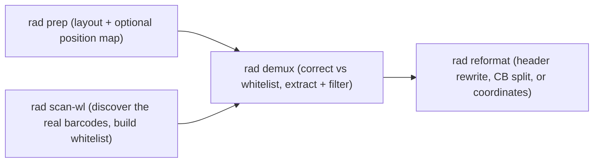

# RAD (Read-structure Agnostic Demultiplexer)

[](https://anaconda.org/bioconda/rad)
[](https://anaconda.org/bioconda/rad)
[](LICENSE)
[](https://github.com/indianewok/rad/commits)

RAD is a read-structure agnostic demultiplexer for dealing with long-read sequencing. TL;DR: all you should have to do is define the read structure if you've got a super-wonky custom sequencing format, pass it to RAD, see if it preps nicely, and let it demultiplex! I've used it with a whole bunch of stuff--weirdest so far has been long-read targeted enrichment of BCR/TCR from Visium HD data, so if you've got weirder than that I'd love to see whether RAD works for you!

## Docs map

| Need | File |
| --- | --- |
| Install + first run (discover barcodes with `scan-wl`, then `demux`) | [`docs/installation.md`](docs/installation.md) |
| Command flags + output files | [`docs/cli-reference.md`](docs/cli-reference.md) |
| Layout + whitelist details (origins, sizes, pairings) | [`docs/layouts-and-whitelists.md`](docs/layouts-and-whitelists.md) |
| What RAD does under the hood | [`docs/architecture.md`](docs/architecture.md) |
| End-to-end smoke test on simulated data | [`test_data/README.md`](test_data/README.md) |

## Pipeline at a glance



`rad demux -A/--auto-wl` folds the `scan-wl` step into `demux`, so a single command
discovers the barcodes and demultiplexes against them.

## Minimal run

```bash
cmake -S . -B build -DCMAKE_BUILD_TYPE=Release
cmake --build build -j

curl -L -o test.fq.gz \
  https://github.com/indianewok/rad/releases/download/test-data-v1/shuffled_S_lr_synth.fq.gz

build/rad demux -l sctagger -q test.fq.gz -d run -o demo -t 1
```

(`sctagger` carries a default whitelist, so this demuxes straight away. On your own data,
first discover the real barcodes with `rad scan-wl` — or add `-A/--auto-wl` to the `demux`
line to do it in one command.)

See [`test_data/README.md`](test_data/README.md) for the full smoke test (scan-wl + demux + expected outputs).

## Repo layout

```text
.
├── src/                  # CLI entrypoints
├── include/rad/          # core pipeline + algorithms
├── resources/
│   ├── read_layout/      # bundled layout templates
│   └── wl/               # bundled whitelist resources
├── docs/                 # user + methods docs
└── CMakeLists.txt
```

## Operational notes

- RAD resolves `resources/` from `$RAD_RESOURCES` if set, otherwise by climbing up from the executable's directory, then the compile-time source dir, then `./resources` in the working directory.
- Install `pigz` alongside the build deps — RAD uses it for parallel gzip I/O. (It will fall back to plain zlib if missing; `RAD_NO_PIGZ=1` forces that fallback.)
- `rad demux --bc-split` is shown in help, but split output is handled by `rad reformat --split-bc` in the current build.
- Use `rad list` to see registered layout/whitelist keys and `rad modify` to add/remove them; those overrides persist to `~/.rad/layout_overrides.tsv` and `~/.rad/whitelist_overrides.tsv`.
- After big source/header edits, do a clean rebuild:

```bash
cmake --build build --clean-first
```

## License

[`LICENSE`](LICENSE)
