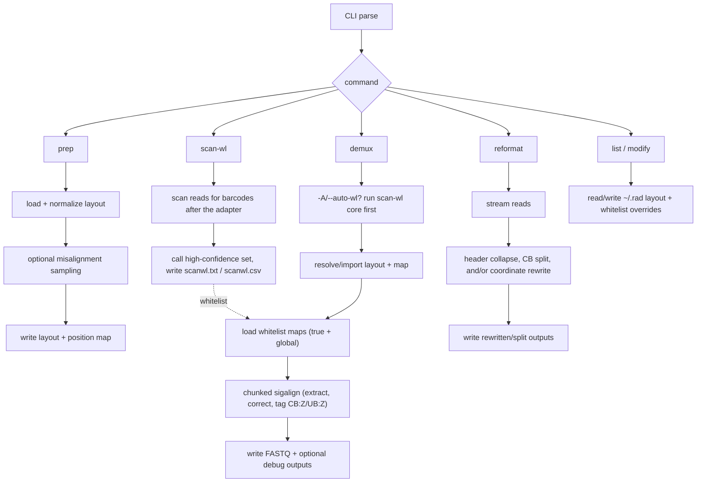
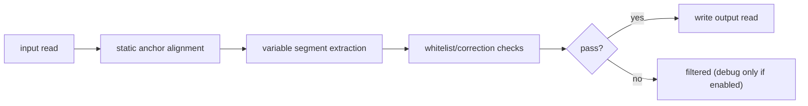

# Architecture

This is the short methods-level view of what RAD does internally.

## Core pieces

| Component | Job |
| --- | --- |
| `src/main.cpp` | CLI dispatch (`prep`, `scan-wl`, `demux`, `reformat`, `list`, `modify`) |
| `include/rad/read_layout.hpp` | layout parsing/normalization + position-map logic |
| `include/rad/barcode_correction.hpp` | whitelist import and barcode set structures |
| `include/rad/whitelist_generator.hpp` | `scan-wl` core: barcode scanning + de-novo whitelist calling (also used by `demux --auto-wl`) |
| `include/rad/sigstring.hpp` | per-read extraction/alignment/filtering (`sigalign`) |
| `include/rad/io_streaming.hpp` | chunk streaming, pigz/gzip I/O, write queues |
| `include/rad/misc_utils.hpp` | resource resolution + `list`/`modify` layout/whitelist registry (persisted to `~/.rad`) |
| `src/config_tools.cpp` | `rad_config` standalone helper (same registry as `rad list`/`rad modify`) |

## Command-level flow

The intended per-run path is `scan-wl` (or `demux --auto-wl`) to build the whitelist, then
`demux` to correct against it, then optional `reformat`. `prep` builds layout/map state;
`list`/`modify` manage the layout/whitelist registry.

## Layout processing (`prep_new_layout`)

What happens:

1. parse CSV rows
2. normalize fields (`class`, `class_id`, lengths)
3. inject sentinels (`seq_start`, `seq_stop`)
4. auto-generate reverse-complement elements unless rows are single-sided
5. build ordered indexes that `demux` uses later

If `--position-map` is set, RAD samples reads, computes misalignment stats, then writes `_layout.csv` and `_position_map.csv`.

## Whitelist discovery (`scan-wl`)

`scan-wl` is the barcode-detection step that produces the whitelist `demux` corrects against:

1. find the adapter/primer in each read and extract the barcode-length window after it
2. tally observed barcodes across the dataset
3. call a high-confidence set (de-novo, optionally validated against a reference kit)
4. write `<prefix>.txt` (the whitelist, one barcode per line) and `<prefix>.csv` (per-barcode stats)

`demux --auto-wl` runs this same core internally and loads the detected barcodes as the
whitelist, so one command does discovery + demultiplexing.

## Demux pipeline (`sigalign`)

Runtime flow:

1. (optional) with `-A/--auto-wl`, run the `scan-wl` core first and use the detected barcodes as the whitelist
2. load or build layout/map
3. resolve/load whitelist data (`true_bcs` + `global_bcs`)
4. stream reads in chunks
5. process each read with:
   - `sigalign_static`
   - `sigalign_variable`
   - `sigalign_filter`
6. emit passing reads (tagging `CB:Z` = corrected cell barcode, `UB:Z` = UMI) and optional debug channels
7. write whitelist summaries

On reverse-oriented reads the barcode is flipped back to the plus strand during correction;
`UB:Z` is likewise reverse-complemented by default so it shares `CB:Z`'s orientation
(`demux --no-umi-rc` keeps UMIs exactly as extracted).

Per-read logic:

## Whitelist model

- `true_bcs`: stricter accepted set
- `global_bcs`: broader correction candidate set

Import behavior:
- one source: RAD assigns based on set size policy
- two sources: smaller usually maps to `true`, larger to `global`

## Parallelism and I/O

- read path: chunked streaming, `pigz` if available
- compute path: OpenMP across chunks/reads
- write path: buffered/asynchronous writer path

Main performance knobs:
- `-t, --threads`
- `-z, --chunk-size`
- `pigz` availability/config

## Practical implementation notes

- `demux -b/--bc-split` appears in help, but split execution is handled in `reformat --split-bc` in the current build (the demux-side split is a stub).
- `rad modify` (and the `rad_config` helper) persist layout/whitelist overrides to `~/.rad/layout_overrides.tsv` and `~/.rad/whitelist_overrides.tsv`, so mappings survive across invocations.
