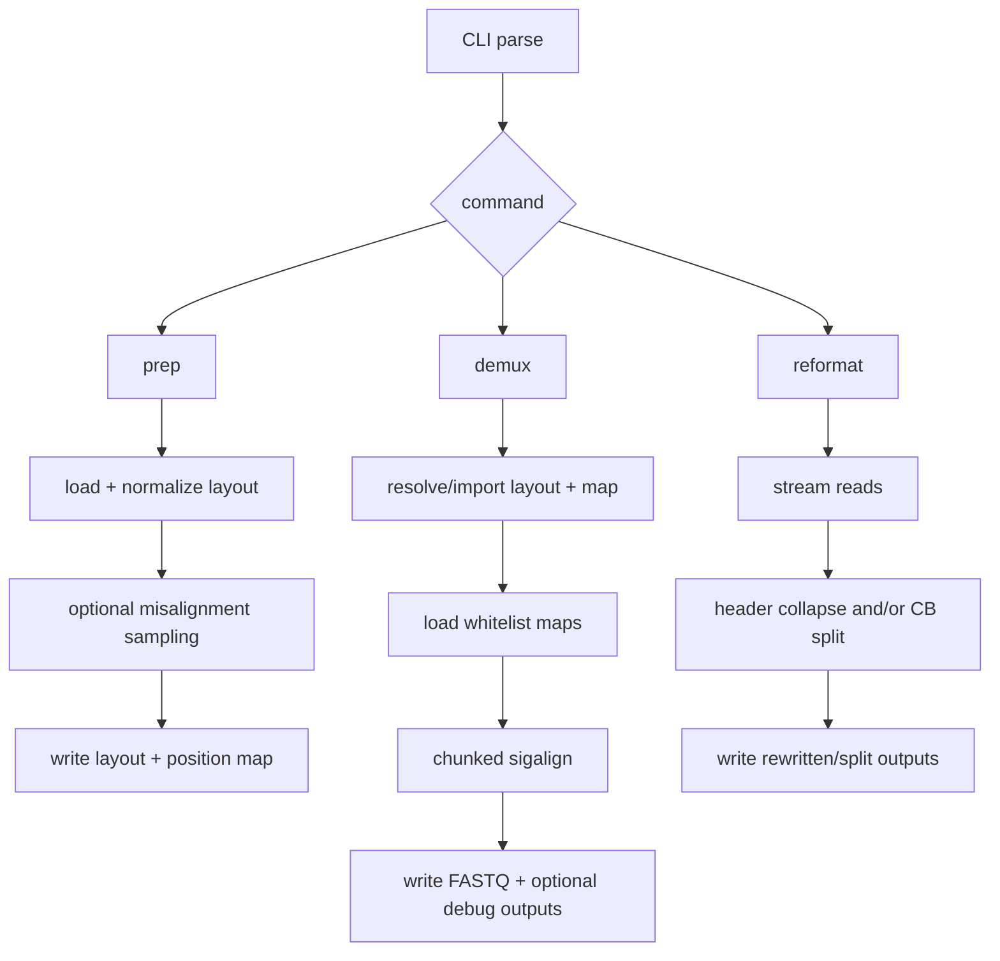
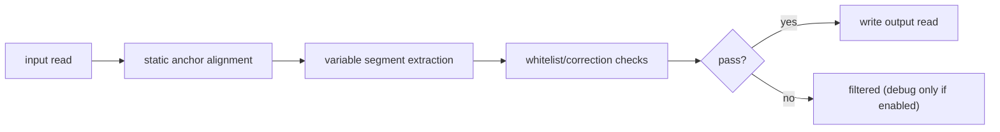

# Architecture

This is the short methods view of what RAD is doing.

## Core pieces

| Component | Job |
| --- | --- |
| `src/main.cpp` | CLI dispatch (`prep`, `demux`, `reformat`) |
| `include/rad/read_layout.hpp` | layout parsing/normalization + position-map logic |
| `include/rad/barcode_correction.hpp` | whitelist import and barcode set structures |
| `include/rad/sigstring.hpp` | per-read extraction/alignment/filtering (`sigalign`) |
| `include/rad/io_streaming.hpp` | chunk streaming, pigz/gzip I/O, write queues |
| `src/config_tools.cpp` | `rad_config` alias interface |

## Command-level flow

## Layout processing (`prep_new_layout`)

What happens:

1. parse CSV rows.
2. normalize fields (`class`, `class_id`, lengths).
3. inject sentinels (`seq_start`, `seq_stop`).
4. auto-generate reverse-complement elements unless single-sided.
5. build ordered indexes used later by demux.

If `--position-map` is set:

- RAD samples reads,
- computes misalignment stats,
- writes `_layout.csv` and `_position_map.csv`.

## Demux pipeline (`sigalign`)

At runtime:

1. load or build layout/map.
2. resolve/load whitelist data (`true_bcs` + `global_bcs` strategy).
3. stream reads in chunks.
4. process each read with:
   - `sigalign_static`
   - `sigalign_variable`
   - `sigalign_filter`
5. emit pass reads; optionally emit debug channels.
6. write whitelist summaries.

Per-read logic:

## Whitelist model (internal)

- `true_bcs`: stricter accepted set.
- `global_bcs`: broader correction candidate set.

Import behavior:

- one source -> assigned based on set size policy.
- two sources -> smaller tends to map to `true`, larger to `global`.

## Parallelism and I/O

- read path: chunked streaming, pigz if available.
- compute path: OpenMP over chunks/reads.
- write path: buffered/asynchronous writer path.

Main perf knobs:

- `--threads`
- `--chunk_size`
- `pigz` availability/config

## Current interface caveats

- `demux --bc_split` is listed, but split execution there is stubbed.
- `rad_config set/rm` is not persistent across independent invocations--need to fix that.
