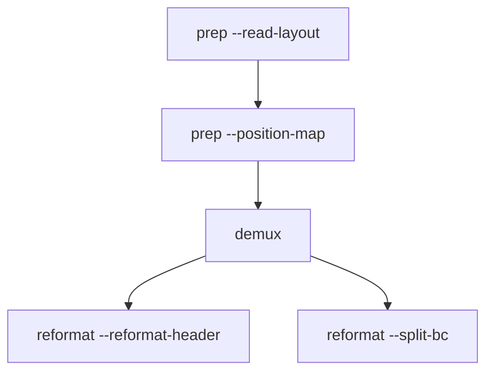

# Installation and first run

This page covers dependency setup, build, and the standard first RAD run (`prep -> demux -> reformat`).

## 1) Required dependencies

- CMake `>= 3.18`
- C++17 compiler
- OpenMP runtime
- Boost (`filesystem`, `system`, `iostreams`)
- zlib

Optional:
- `pigz` (usually much faster `.gz` I/O)

## 2) Install dependencies by platform

### macOS (Homebrew)

```bash
brew install cmake boost libomp llvm pigz
```

Using Homebrew LLVM usually gives cleaner OpenMP linkage:

```bash
cmake -S . -B build -DCMAKE_BUILD_TYPE=Release \
  -DCMAKE_C_COMPILER="$(brew --prefix llvm)/bin/clang" \
  -DCMAKE_CXX_COMPILER="$(brew --prefix llvm)/bin/clang++"
cmake --build build -j
```

### Ubuntu / Debian

```bash
sudo apt update
sudo apt install -y \
  build-essential cmake \
  libboost-all-dev zlib1g-dev \
  libomp-dev pigz
```

### RHEL / Rocky / Alma

```bash
sudo dnf install -y \
  gcc gcc-c++ cmake \
  boost-devel zlib-devel \
  libgomp pigz
```

### Conda/Mamba user-space toolchain

```bash
mamba create -n rad-build -y \
  cmake cxx-compiler compilers \
  boost zlib libgomp pigz
mamba activate rad-build

cmake -S . -B build -DCMAKE_BUILD_TYPE=Release
cmake --build build -j
```

## 3) Build RAD

```bash
git clone --recurse-submodules https://github.com/indianewok/rad.git
cd rad

cmake -S . -B build -DCMAKE_BUILD_TYPE=Release
cmake --build build -j
```

Quick verification:

```bash
build/rad --help
build/rad_config --help
```

## 4) First run (standard path)

Create a run directory:

```bash
mkdir -p run
```

Assumes:
- `build/rad` exists
- input reads are available (for example `reads.fq.gz`)

Check the layout:

```bash
build/rad prep -l five_prime --read-layout
```

Custom layouts work too:

```bash
build/rad prep -l /abs/path/layout.csv --read-layout
```

Build a position map:

```bash
build/rad prep \
  -l five_prime \
  --position-map \
  -q reads.fq.gz \
  -o run/demo \
  -n 50000 \
  -t 8
```

Expected files:
- `run/demo_layout.csv`
- `run/demo_position_map.csv`

Run demux:

```bash
build/rad demux \
  -l five_prime \
  -q reads.fq.gz \
  -o demo \
  -d run \
  -t 8
```

Expected file:
- `run/demo.fq.gz`

Optional debug run:

```bash
build/rad demux \
  -l five_prime \
  -q reads.fq.gz \
  -o demo \
  -d run/debug \
  -t 8 \
  -w
```

Debug outputs:
- `run/debug/demo_dbg.sig.gz`
- `run/debug/demo_dbg.csv.gz`
- `run/debug/demo_dbg.fq.gz`
- `run/debug/demo.metrics.tsv`

Optional reformat step:

```bash
build/rad reformat -q run/demo.fq.gz --reformat-header -t 8
build/rad reformat -q run/demo.fq.gz --split-bc -o run/by_barcode -t 8
```

Whitelist selection patterns:

```bash
build/rad demux -l five_prime -q reads.fq.gz -k 10x_5v1 -o demo -d run

build/rad demux \
  -l five_prime \
  -q reads.fq.gz \
  -g /data/global_wl.csv.gz \
  -c /data/true_wl.csv.gz \
  -o demo \
  -d run
```

Workflow sketch:



Quick sanity checks:

```bash
build/rad --help
build/rad prep --help
build/rad demux --help
build/rad reformat --help
```

## 5) Runtime notes

RAD expects `resources/` to be discoverable from executable/CWD search paths.
If binaries are moved, move `resources/` with them (or run from the repo tree).

Environment knobs:
- `RAD_PIGZ=/path/to/pigz`
- `RAD_NO_PIGZ=1`
- `RAD_PIGZ_THREADS=<N>`

Clean rebuild:

```bash
cmake --build build --clean-first
```
