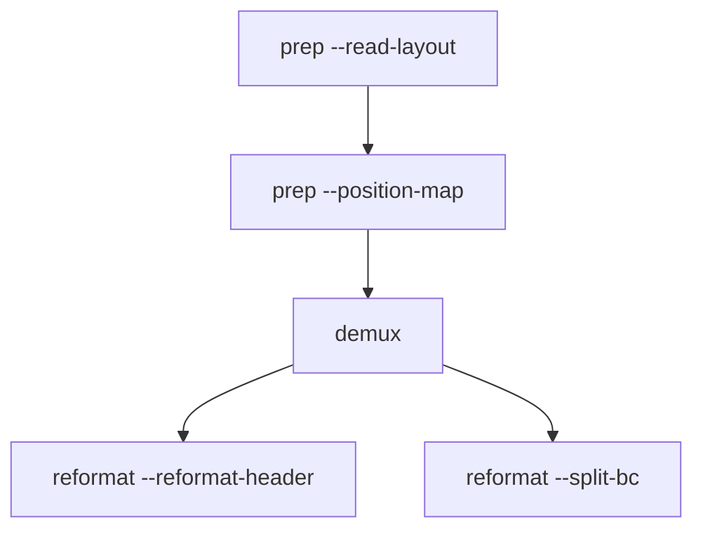

# Quickstart

This is the standard RAD run path!

## 1) Setup

```bash
mkdir -p run
```

Assumes:

- `build/rad` exists,
- input reads are available (for example `reads.fq.gz`).

## 2) Inspect layout

```bash
build/rad prep -l five_prime --read-layout
```

Custom layout file works too:

```bash
build/rad prep -l /abs/path/layout.csv --read-layout
```

## 3) Build position map

```bash
build/rad prep \
  -l five_prime \
  --position-map \
  -q reads.fq.gz \
  -o run/demo \
  -n 50000 \
  -t 8
```

Expected files:

- `run/demo_layout.csv`
- `run/demo_position_map.csv`

## 4) Run demux

```bash
build/rad demux \
  -l five_prime \
  -q reads.fq.gz \
  -o demo \
  -d run \
  -t 8
```

Expected file:

- `run/demo.fq.gz`

## 5) Optional debug run

```bash
build/rad demux \
  -l five_prime \
  -q reads.fq.gz \
  -o demo \
  -d run/debug \
  -t 8 \
  -w
```

Debug outputs:

- `run/debug/demo_dbg.sig.gz`
- `run/debug/demo_dbg.csv.gz`
- `run/debug/demo_dbg.fq.gz`
- `run/debug/demo.metrics.tsv`

## 6) Optional reformat step

Header collapse (`QNAME_CB_UB`):

```bash
build/rad reformat -q run/demo.fq.gz --reformat-header -t 8
```

Barcode split:

```bash
build/rad reformat -q run/demo.fq.gz --split-bc -o run/by_barcode -t 8
```

## 7) Whitelist selection patterns

Kit alias:

```bash
build/rad demux -l five_prime -q reads.fq.gz -k 10x_5v1 -o demo -d run
```

Explicit files:

```bash
build/rad demux \
  -l five_prime \
  -q reads.fq.gz \
  -g /data/global_wl.csv.gz \
  -c /data/true_wl.csv.gz \
  -o demo \
  -d run
```

## 8) Flow chart



## 9) Sanity check commands

```bash
build/rad --help
build/rad prep --help
build/rad demux --help
build/rad reformat --help
```
